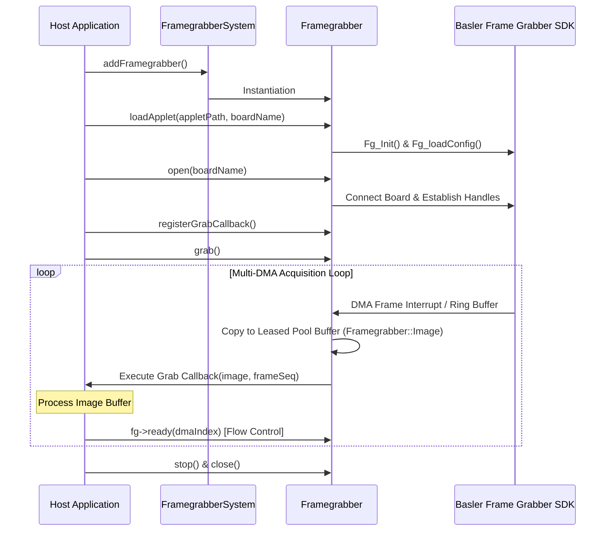

# 🖼️ Framegrabber Module

[](https://en.cppreference.com/w/cpp/compiler_support)
[](#)
[](https://www.baslerweb.com/)

Basler frame grabber 보드 탐색, 애플릿/MCF 구성, 다중 DMA 고속 이미지 수신 및 CoaXPress 카메라 제어를 제공하는 Pure C++ 이미지 취득(Acquisition) 라이브러리 모듈입니다.

---

## 🚀 Key Features

* **강력한 프레임그래버 수명주기 관리**: Basler Frame Grabber SDK(microDisplay / fglib)를 래핑하여 보드 탐색, Applet/MCF 로딩, Multi-DMA 이미지 수신을 안전하게 핸들링합니다.
* **독자적 DMA 버퍼 포인터 메모리 모델**: SDK 링 버퍼를 직접 노출하지 않고 `Framegrabber::Image` 내부에 안전하게 소유권을 전이(`std::shared_ptr`)하며, DMA 버퍼 풀 레벨의 락 프리 메모리 재사용을 보장합니다.
* **CXP / GenICam 카메라 제어 통합**: SISO GenICam SDK 기반의 CoaXPress 카메라 자동 디스커버리 및 GenICam 노드 트리 연동(속성 읽기/쓰기, 커맨드 실행)을 제공합니다.
* **다양한 PixelFormat 변환 및 스트라이드 지원**: Mono, RGB, BGR, YUV/YCbCr, Bayer 2x2 복원, BiColor 등 광범위한 DMA 출력을 명시적으로 매핑하며, `FG_TRANSFER_LEN` 기반의 안전한 페이로드를 제공합니다.
* **독립적 로깅 및 백프레셔 제어**: `FramegrabberSystem::syslog()`를 통한 표준 스트림 기반 로깅과 프레임 드롭 방지를 위한 `ready(dmaIndex)` 흐름 제어 신호를 기본 내장하고 있습니다.

---

## 📦 System Architecture

보드 탐색, 애플릿 로딩, 다중 DMA 이미지 수신 루프의 간결한 흐름도입니다.



---

## 🛠️ Requirements & Dependencies

| Requirement | Description |
| :--- | :--- |
| **OS Support** | Windows / Linux (Basler Frame Grabber SDK 지원 OS) |
| **C++ Standard** | C++17 이상 필수 (C++20 권장) |
| **Frame Grabber SDK** | Basler Frame Grabber SDK 5.x 이상 (환경 변수 `BASLER_FG_SDK_DIR` 또는 `SISODIR5` 설정 필요) |
| **GenICam SDK** | CoaXPress 카메라 제어 시 Siso GenICam 라이브러리 연동 |

---

## 💻 Quick Start

### 1. CMake Integration
상위 프로젝트 CMakeLists.txt에서 서브디렉토리로 등록한 후 타겟 링크합니다. Pure C++ 전용으로 빌드할 경우 Qt 위젯 옵션을 `OFF`로 설정합니다.

```cmake
# Qt 위젯 미사용 Pure C++ 전용 빌드 시 (선택)
set(FRAMEGRABBER_BUILD_QT_WIDGET OFF CACHE BOOL "" FORCE)

# Add module target
add_subdirectory(modules/Framegrabber/C++)

# Link to host target
target_link_libraries(YourHostApp PRIVATE Framegrabber)
```

> **SDK 경로 설정**: Basler Frame Grabber SDK가 기본 경로(`/opt/Basler/FramegrabberSDK` 또는 `C:/Program Files/Basler/FramegrabberSDK`)에 설치되어 있지 않은 경우, CMake 실행 전 `BASLER_FG_SDK_DIR` 환경 변수 또는 CMake 변수를 지정해 주어야 합니다.

### 2. Basic Example
```cpp
#include "FramegrabberSystem.h"
#include "Framegrabber.h"
#include <iostream>

int main()
{
    FramegrabberSystem system;
    system.updateFramegrabberList();

    auto boards = system.getCachedBoardInfo();
    if (boards.empty()) {
        std::cerr << "No Framegrabber board detected." << std::endl;
        return 1;
    }

    Framegrabber* fg = system.addFramegrabber();

    // 1. 애플릿 지정 및 보드 오픈
    std::string appletPath = system.getBoardAppletPath(boards[0].name);
    if (!fg->loadApplet(appletPath, boards[0].name) || !fg->open(boards[0].name)) {
        std::cerr << "Failed to open Framegrabber board: " << boards[0].name << std::endl;
        return 1;
    }

    // 2. 이미지 Grab 콜백 등록
    fg->registerGrabCallback([fg](const Framegrabber::Image& image, std::size_t frameSeq) {
        std::cout << "Acquired Frame #" << frameSeq 
                  << " [DMA: " << image.dmaIndex 
                  << ", Size: " << image.width << "x" << image.height << "]" << std::endl;
        
        // 중요: 처리 완료 후 해당 DMA 채널의 ready 신호를 보냅니다.
        fg->ready(image.dmaIndex);
    });

    // 3. Grabbing 시작 (연속 취득)
    fg->grab();

    // ... 비동기 취득 진행 ...

    // 4. 해제 시
    fg->stop();
    fg->close();

    return 0;
}
```

### 3. OpenCV (`cv::Mat`) Integration
`Framegrabber::Image`의 생 포인터와 `stride` 정보를 활용하여 복사 없이 `cv::Mat`으로 직접 래핑할 수 있습니다.

```cpp
fg->registerGrabCallback([fg](const Framegrabber::Image& image, std::size_t frameSeq) {
    if (!image.isValid()) return;

    cv::Mat mat;
    switch (image.pixelFormat) {
    case Framegrabber::PixelFormat::Mono8:
        mat = cv::Mat(image.height, image.width, CV_8UC1, 
                      const_cast<std::uint8_t*>(image.data()), image.stride);
        break;
    case Framegrabber::PixelFormat::BGR24:
        mat = cv::Mat(image.height, image.width, CV_8UC3, 
                      const_cast<std::uint8_t*>(image.data()), image.stride);
        break;
    case Framegrabber::PixelFormat::RGB24: {
        cv::Mat rgb(image.height, image.width, CV_8UC3, 
                     const_cast<std::uint8_t*>(image.data()), image.stride);
        cv::cvtColor(rgb, mat, cv::COLOR_RGB2BGR);
        break;
    }
    default:
        break;
    }

    // OpenCV 이미지 처리 (예: cv::imshow, cv::imwrite 등)

    // 처리 완료 후 반드시 ready 호출
    fg->ready(image.dmaIndex);
});
```

---

## ⚠️ Development Notes

> [!IMPORTANT]
> **백프레셔 및 DMA 흐름 제어 (`ready(dmaIndex)`)**
> 고속 DMA 이미지 수신 시 호스트 처리 지연으로 인한 ring buffer overflow 및 memory pool exhaustion을 방지하기 위해 흐름 제어를 사용합니다. Grab 콜백 처리 완료 후 해당 프레임의 DMA 채널 인덱스에 대해 반드시 `fg->ready(image.dmaIndex)`를 호출해야 다음 프레임을 인큐합니다.

> [!IMPORTANT]
> **DMA 버퍼 라이프타임 및 버퍼 풀 (Buffer Pool)**
> `Framegrabber::Image`는 SDK의 링 버퍼에서 소유권을 갖는 메모리 풀 블록으로 복사된 래퍼(`std::shared_ptr<const uint8_t>`)를 가집니다. 사용자는 SDK 버퍼 포인터 해제에 관하여 신경 쓸 필요가 없으나, 프레임 수신 콜백 바깥으로 `Image` 객체를 장시간 보관할 경우 버퍼 풀 고갈이 발생할 수 있습니다.

> [!WARNING]
> **스레드 안전성 및 워커 스레드**
> Grab 콜백 및 NodeUpdated 콜백은 SDK DMA 백그라운드 워커 스레드에서 직접 호출됩니다. 콜백 내부에서 예외를 던지거나 스레드를 블로킹해서는 안 되며, GUI 또는 타 스레드로 전달할 경우 적절한 스레드 간 동기화(Thread Synchronization)를 거쳐야 합니다.

> [!CAUTION]
> **자원 해제 수명주기**
> 애플리케이션 종료 시 `FramegrabberSystem`이 소멸하기 전에 `fg->stop()`, `fg->close()`를 호출하여 DMA 수신 워커와 보드 핸들을 정상적으로 닫아야 합니다. `stop()` 호출 시 진행 중인 DMA 작업 및 워커 스레드가 모두 조인(Join)될 때까지 대기합니다.
